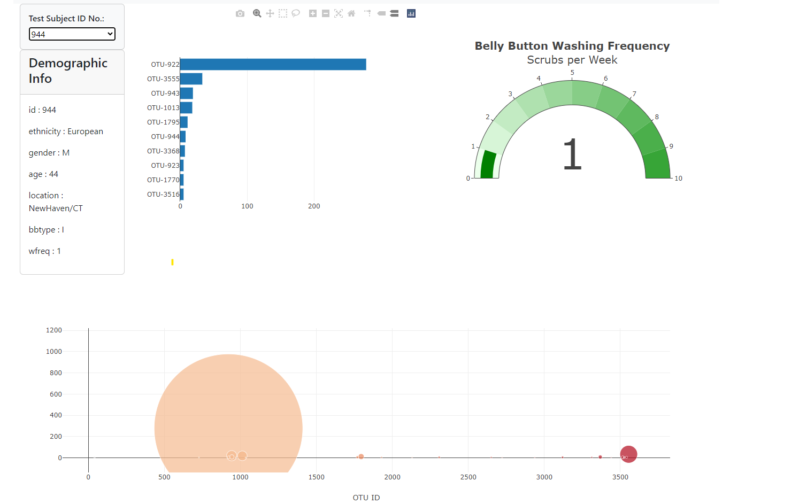

# belly-button-challenge
Module 14 Challenge Belly Button Challenge

https://indubt.github.io/belly-button-challenge/

## Background
In this assignment, you will build an interactive dashboard to explore the Belly Button Biodiversity datasetLinks to an external site., which catalogs the microbes that colonize human navels.

The dataset reveals that a small handful of microbial species (also called operational taxonomic units, or OTUs, in the study) were present in more than 70% of people, while the rest were relatively rare.

## Instructions
Complete the following steps:

1. Use the D3 library to read in samples.json from the URL https://static.bc-edx.com/data/dl-1-2/m14/lms/starter/samples.json.

2. Create a horizontal bar chart with a dropdown menu to display the top 10 OTUs found in that individual.

    a. Use `sample_values` as the values for the bar chart.

    b. Use `otu_ids` as the labels for the bar chart.

    c. Use `otu_labels` as the hovertext for the chart.

    

3. Create a bubble chart that displays each sample.

    a. Use `otu_ids` for the x values.

    b. Use `sample_values` for the y values.

    c. Use `sample_values` for the marker size.

    d. Use `otu_ids` for the marker colors.

    e. Use `otu_labels` for the text values.

    

4. Display the sample metadata, i.e., an individual's demographic information.

5. Display each key-value pair from the metadata JSON object somewhere on the page.
    

6. Update all the plots when a new sample is selected. Additionally, you are welcome to create any layout that you would like for your dashboard.
    

7. Deploy your app to a free static page hosting service, such as GitHub Pages.
    

## Advanced Challenge Assignment

The following task is advanced and therefore optional.

1. Adapt the Gauge Chart from https://plot.ly/javascript/gauge-charts/Links to an external site. to plot the weekly washing frequency of the individual.

2. You will need to modify the example gauge code to account for values ranging from 0 through 9.

3. Update the chart whenever a new sample is selected.

    

## Hints
 - Use console.log inside of your JavaScript code to see what your data looks like at each step.

 - Refer to the Plotly.js documentationLinks to an external site. when building the plots.

 ## Reference Links
- http://robdunnlab.com/projects/belly-button-biodiversity/
- https://d3js.org/
- https://docs.github.com/en/pages/getting-started-with-github-pages/configuring-a-publishing-source-for-your-github-pages-site
- https://plotly.com/javascript/gauge-charts/
- https://plotly.com/javascript/bubble-charts/
- https://plotly.com/javascript/